# Snake: AI 🆚 A*

O jogo da cobrinha é um clássico do Nokia tijolão. Ele possui regras e objetivos simples, mas ainda sim é bem difícil de zerar.

Será que uma AI (rede neural) consegue zerar ele? E um algoritmo pathfinder (A*)? Qual dos dois se sairia melhor?

Nesse projeto vamos responder todas essas perguntas!

  

## 1 - Implementação do jogo

Acabei fazendo tudo em C#, por ser a linguagem que mais domino. Pra UI usei WPF, então infelizmente só vai rodar no Windows.

Também implementei duas versões do jogo:
- Uma mais simples, onde a cobra não aumenta de tamanho ao pegar a comida.
- A clássica, onde a cobra aumenta uma unidade a cada comida coletada.

Pensar em uma versão mais simples do problema geralmente ajuda no entendimento e na resolução do problema original.

  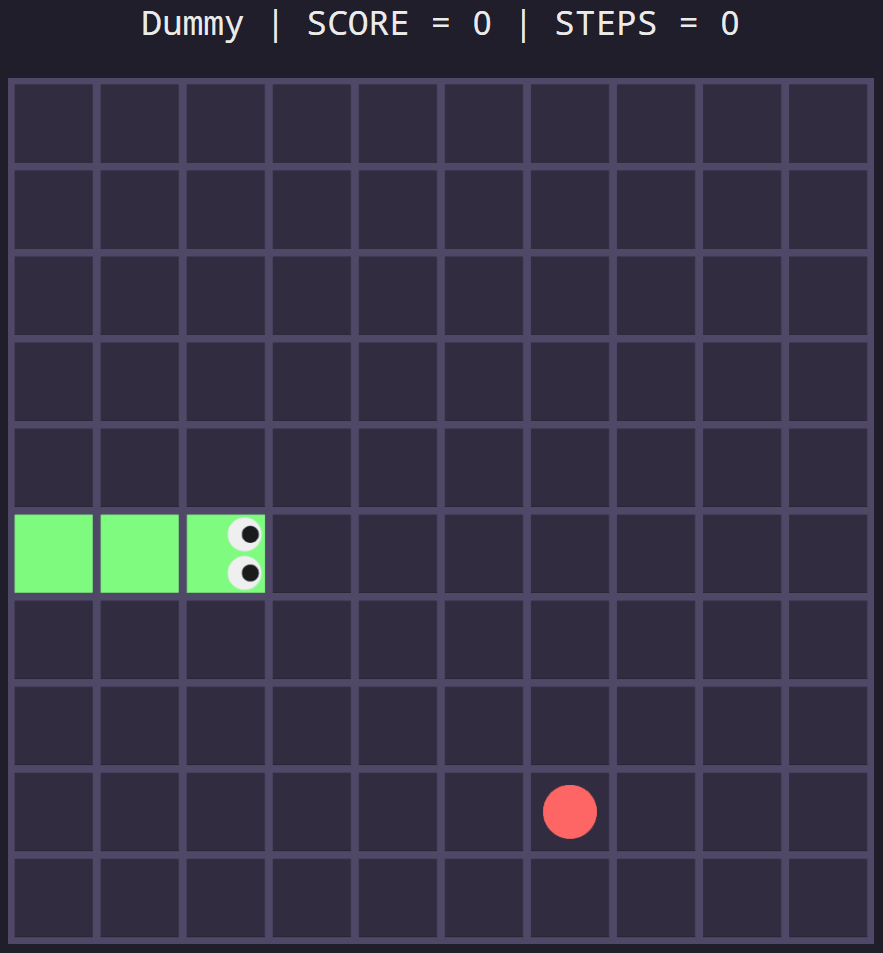
  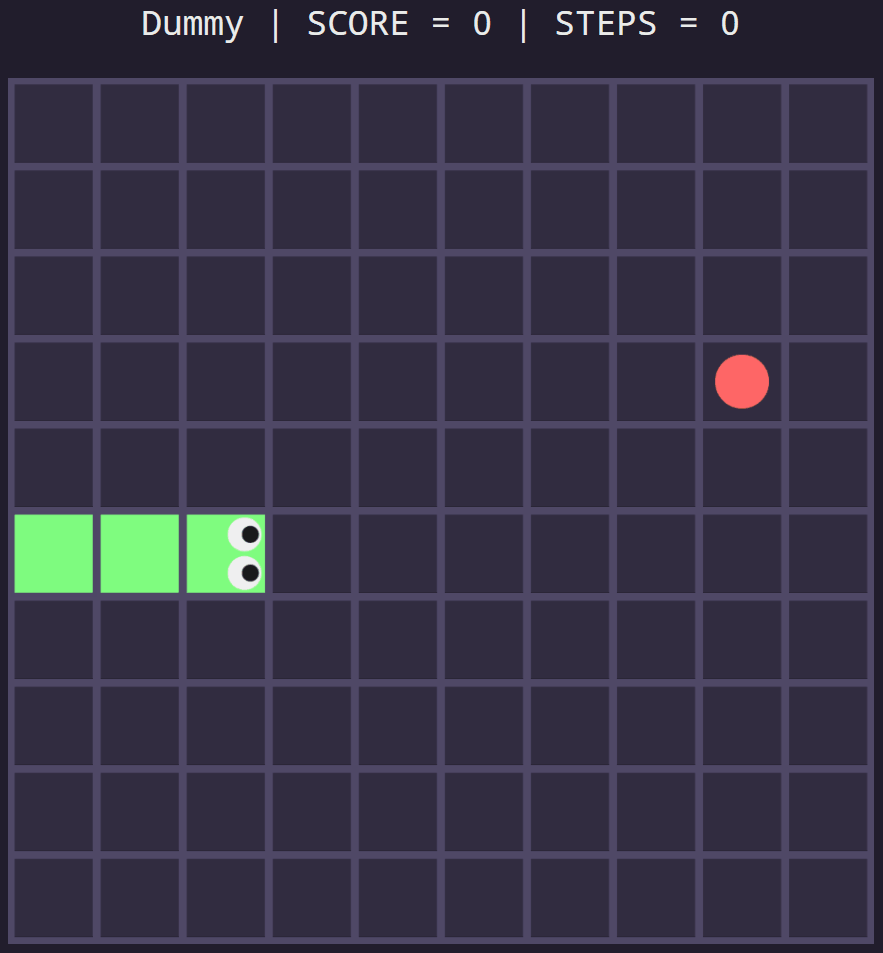

Organizei o projeto em 3 partes:
- **Core**: aqui fica o estado do jogo, juntamente com suas regras
- **UI**: responsável por mostrar na tela o estado atual do jogo
- **Players**: dão a direção pra cobra seguir, alterando o estado do jogo

No caso dos players, temos 4 opções:
- **Human**: um humano pode jogar usando o teclado
- **Dummy**: um algoritmo simples (monte de if/else) que guia a cobra diretamente até a comida
- **Neural**: uma rede neural que recebe dados do estado do jogo e decide pra onde a cobra deve ir
- **Star**: um algoritmo A* modificado, que também recebe o estado do jogo e define a próxima direção da cobra

Também adicionei **testes automatizados** que validam tanto as regras do jogo (Core) quanto os algoritmos dos players.

A ideia de separar Core, UI e Players traz algumas vantagens:
- Consigo realizar testes unitários em cada parte do sistema separadamente
- Dá pra avaliar o desempenho de cada player em milhares de jogos, apenas usando o Core (sem o custo de renderizar a UI)
- Pro caso do player Neural, é possível realizar o treinamento da rede apenas usando o Core (novamente, sem o custo de renderizar a UI)

  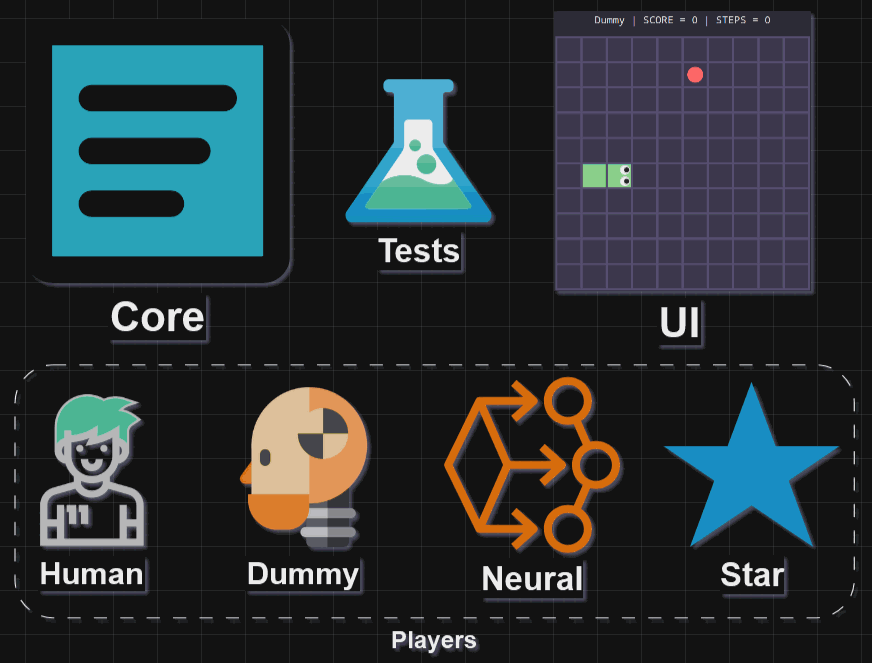

## 2 - Human

Esse player serviu apenas para que eu pudesse jogar durante a implementação.

Até pensei em criar um modo onde é possível jogar contra os outros players:
- Um humano controlando uma cobra via teclado
- Um dos outros 3 algoritmos controlando outra cobra, dentro do mesmo ambiente
- Apenas uma comida aparece por vez, pra ver quem consegue chegar nela primeiro
- Colidir em si mesmo ou na outra cobra faz você perder o jogo

E mais interessante ainda seria um algoritmo contra o outro.

Mas isso tudo vai ficar pra uma v2 desse projeto...

## 3 - Dummy

Esse algoritmo é o mais trivial possível: um conjunto de if/else que direciona a cobrinha pra linha/coluna da comida.

Vou usar ele como base de comparação pros outros dois algoritmos (Neural e Star).

  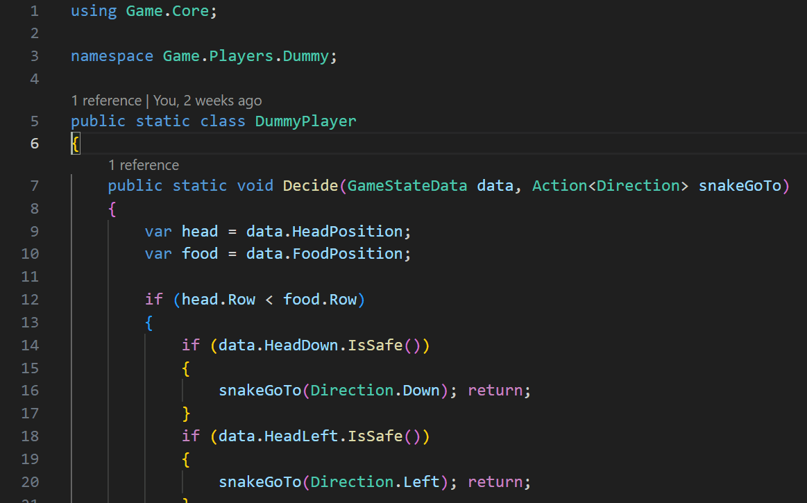

## 4 - Neural

Rede neural é uma técnica de aprendizado de máquina inspirada no funcionamento do cérebro humano. Uma rede é formada por **neurônios**, que são organizados em **camadas** e conectados por meio de **pesos ajustáveis**.

Podemos abstrair uma rede como sendo uma **função**, que é capaz de receber dados de entrada, precessá-los e retornar uma saída.

No nosso caso, a rede vai pegar dados do estado atual do jogo, processá-los internamente e no final retornar pra qual direção a cobra deve ir.

A rede neural desenvolvida neste projeto é formada por:
- 4 neurônios na camada de entrada
- 8 neurônios na camada oculta
- 4 neurônios na camada de saída

O treinamento dela foi feito utilizando um **algortimo genético**.

### 4.1 - Funcionamento

Durante o jogo, logo antes da cobra se movimentar, os dados do estado atual do jogo são processados pela rede, que no final retorna para qual direção a cobra deve ir.

#### 4.1.1 Entrada

O diagrama a seguir mostra os dados de entrada da rede:
- **Δx**: "distância" entre a cabeça da cobra e comida na direção x.
  - Na prática, é feita a subtração entre a **coluna** da comida e a da cobra:
    - Caso dê positivo, **Δx=1**
    - Caso estejam na mesma coluna, **Δx=0**
    - Caso dê negativo, **Δx=-1**
- **Δy**: "distância" entre a cabeça da cobra e comida na direção y.
  - Na prática, é feita a subtração entre a **linha** da comida e a da cobra:
    - Caso dê positivo, **Δy=1**
    - Caso estejam na mesma linha, **Δy=0**
    - Caso dê negativo, **Δy=-1**
- **Vx**: velocidade da cobra no eixo x.
- **Vy**: velocidade da cobra no eixo y.

Perceba que as velocidades estão relacionadas, pois se a cobra está indo:
- Pra direita: **Vx=1** e **Vy=0**
- Pra esquerda: **Vx=-1** e **Vy=0**
- Pra baixo: **Vx=0** e **Vy=1**
- Pra cima: **Vx=0** e **Vy=-1**

  

#### 4.1.2 Processamento

Cada **linha tracejada** ligando um neurônio a outro possui um determinado **peso**. Esse peso é um número que pode variar entre -1000 e +1000. Quando uma rede é criada, cada peso é inicializado **aleatoriamente** (mas ainda dentro desses limites).

Cada neurônio da camada oculta recebe os 4 valores de entrada (Δx, Δy, Vx e Vy) e os processa, utilizando os respectivos pesos que interligam os neurônios.

A saída da camada oculta serve de entrada para a última camada da rede, que vai processar os dados e no final dizer pra qual direção a cobra deve seguir.

#### 4.1.3 Output

No final, o output de cada neurônio de saída é um numéro entre 0 e 1. Dessa forma, a cobra acaba seguindo para a direção que retornou o maior valor entre a 4 saídas.

### 4.2 - Treinamento (algoritmo genético)

O treinamento da rede serve para refinar o valor dos seus pesos.

Como foi dito antes, ao criar uma rede nova, todos os pesos são inicializados aleatoriamente.

Como o conjunto dos pesos acaba por definir o comportamento da rede, precisamos de alguma forma ajustar cada valor para que a rede produza saídas que levem a cobra a performar bem no jogo.

Existem várias formas de fazer isso, mas aqui irei utilizar um algoritmo genético bem intuitivo:

⚠️ O processo a seguir será repetido por 1000 gerações ⚠️

- 1️⃣ Vamos criar uma população de 5000 cobras, cada uma com seus próprios pesos aleatórios
- 2️⃣ Cada cobra vai ser colocada pra jogar separadamente
- 3️⃣ Ao final de todos os jogos, vamos analisar o desempenho de cada cobra
- 4️⃣ Um hanking será montado, ordenando as cobras com maior pontuação e com o menor número de movimentos realizados
- 5️⃣ As top 20% das cobras serão selecionadas para jogarem na próxima geração
- 6️⃣ As próximas 20% do hanking serão cruzadas com as 20% anteriores, gerando novas cobras com relativo desempenho no jogo
- 7️⃣ As demais serão descartadas, ou melhor, substituídas por novas cobras com pesos aleatórios

Para evitar que uma cobra fique andando em círculos e o jogo nunca termine, defini um limite de passos que podem ser realizados antes do jogo acabar.

  

Ao final do treinamento, a melhor cobra (rede neural) será selecionada para competir contra os demais players. Ela pode ser representada pelos pesos que ligam seus neurônios e definem o comportamento da cobra no jogo.

Assim, todo treinamento é feito com o objetivo de chegar em duas matrizes de pesos refinados, como as mostradas a seguir:

  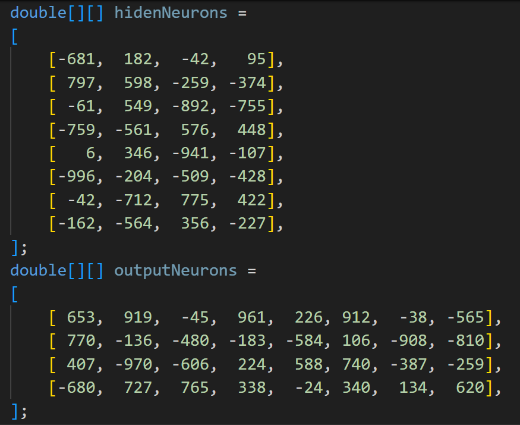

## 5 - Star

A parte mais difícil desse jogo começa quando a cobra ocupa cerca de metade do tabuleiro. A partir daí as chances de se prender no próprio corpo e perder o jogo só aumentam.

Para lidar com isso, o algoritmo a seguir se baseia em 3 coisas:
- **Limitar as direções** de movimento da cobra em cada posição (seguindo um padrão bem definido)
- Buscar o **menor caminho até a comida**, respeitando o limite anterior (usando o algoritmo A*)
- Evitar ao máximo que a cobra crie **regiões vazias fechadas** no tabuleiro, para que a comida surja em locais mais acessíveis

### 5.1 - Limitando as direções

Para limitar as direções possíveis de movimento da cobra em cada posição, repetimos o padrão a seguir por todo o tabuleiro.

Dessa forma, basta que a cobra respeite esses limites para que jamais fique sem saída e acabe perdendo o jogo.

  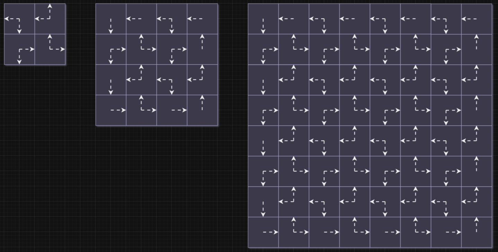

### 5.2 - Buscando o menor caminho

Aqui utilizamos o algoritmo pathfinder A* para definir qual o menor caminho da cabeça da cobra até a comida.

Caso não seja possível chegar até a comida, busca-se o menor caminho até a calda da cobra. Dessa forma, em algum momento a cobra vai chegar numa posição em que é possível acessar a comida novamente.

A seguir podemos ver isso tudo funcionando:
- A cobra sempre se move respeitando as setas (limites de direção)
- Antes de cada movimento, ela calcula o menor caminho até a comida
- Os pontinhos amarelos no GIF representam o caminho calculado

  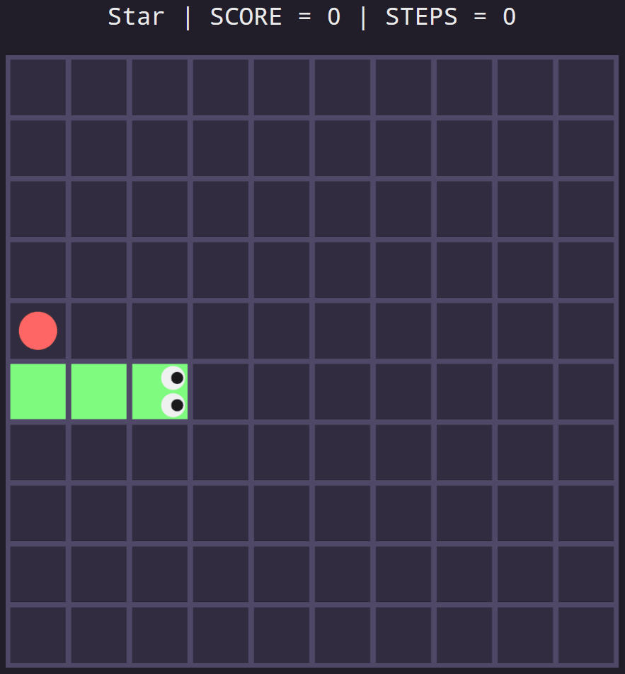

### 5.3 Evitando regiões vazias fechadas

Ao se mover sempre buscando o menor caminho, a cobra acaba criando regiões vazias fechadas no tabuleiro.

Quando uma comida aparece nesses locais, é preciso seguir a calda até que a cobra possa acessar a região da comida novamente.

Isso geralmente custa muitos movimentos, o que impacta significativamente no desempenho final da cobra.

Para lidar com esse problema, imagine que a cobra possui duas direções pra seguir (D1 e D2):
- Se ir na direção D1 produz uma região fechada, mas ir na direção D2 não, então a cobra acaba indo pra D2
- A mesma lógica se aplica pro caso de D2 gerar região fechada e D1 não
- Caso as duas produzam ou nenhuma das duas produza, a cobra vai pelo menor caminho, como definido no passo anterior

Veja a seguir um exemplo de geração de regiões vazias e de como elas reduzem a eficiência da cobra:

  

## 6 - Versão mais simples

Agora que já entendemos como o jogo e os algoritmos funcionam, vamos iniciar com a versão mais simples, onde a cobra não cresce ao pegar a comida.

É esperado que todos os algoritmos se saiam bem nessa versão, pois é impossível perder o jogo por colisão com o próprio corpo.

### 6.1 Dummy

O player Dummy jogou 1000 partidas e ganhou (atingiu 97 pontos) todas!

Veja que a quantidade de movimentos total varia devido à aleatoriedade do jogo, pois a comida pode aparecer em qualquer lugar vazio do tabuleiro.

A média de movimentos até zerar ficou em 678. A quantidade mínima foi 581 e a máxima 812 movimentos.

  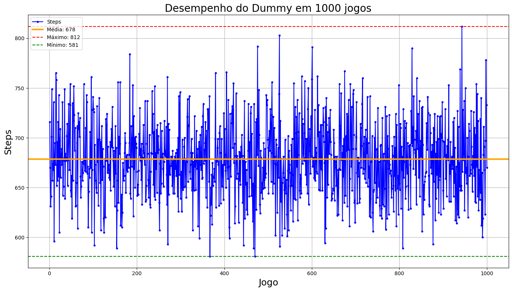

Segue o GIF de uma das partidas:

  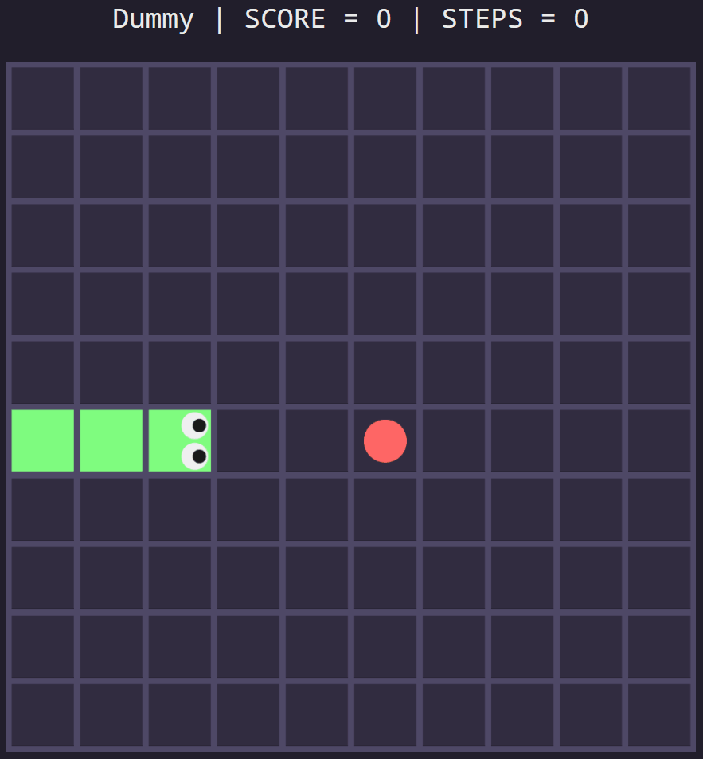

### 6.2 Neural

O treinamento foi feito com 5000 cobras, jogando por 1000 gerações, totalizando 5.000.000 de partidas.

As cobras rapidamente aprenderam a perseguir a comida, pois desde a primeira geração já surgiu pelo menos uma que ganhou o jogo (atingiu 97 pontos).

A partir daí, as cobras que conseguiam zerar com o menor número de movimentos foram sendo selecionadas e passadas para próxima geração.

Podemos verificar a seguir a queda na média de movimentos com o passar das gerações:

  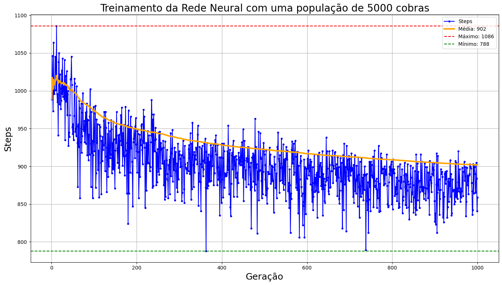

No final foi obtida a cobra com o melhor desempenho, ou seja, que atinge a pontuação máxima utilizando o menor número de movimentos.

O player Neural também jogou 1000 partidas e ganhou (atingiu 97 pontos) todas!

A média de movimentos ficou em 958. A quantidade mínima foi 817 e a máxima 1099 movimentos.

  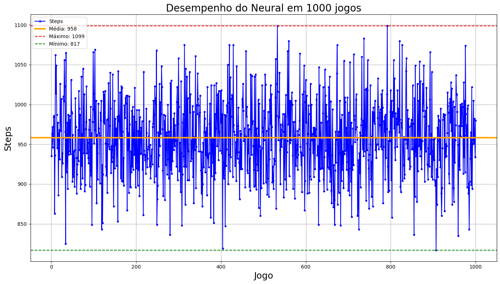

Segue o GIF de uma das partidas:

  

### 6.3 Star

O player Star também jogou 1000 partidas e ganhou (atingiu 97 pontos) todas!

A média de movimentos ficou em 765. A quantidade mínima foi 631 e a máxima 901 movimentos.

  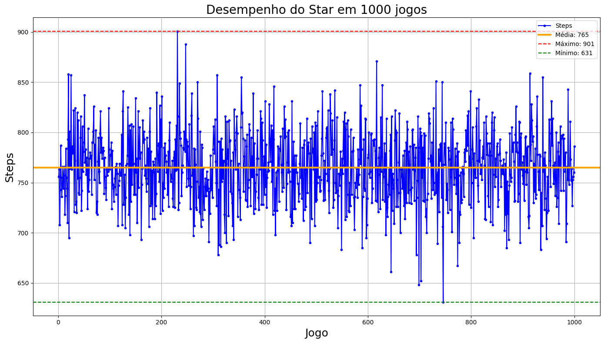

Segue o GIF de uma das partidas:

  

## 7 - Versão clássica

Finalmente vamos realizar a disputa na versão clássica do jogo.

### 7.1 Dummy

Ela só conseguiu pegar em média 19 comidas, ou seja, só conseguiu ocupar 1/5 do tabuleiro antes de morrer.

O valor máximo de 43 pontos se deve ao fato que a comida aparece em locais aleatórios, de forma que a cobra teve sorte da comida nascer em locais favoráreis.

Como o algoritmo não usa nenhuma estratégia para evitar que a cobra fique sem saída, seu desempenho geral acaba sendo extremamente baixo.

  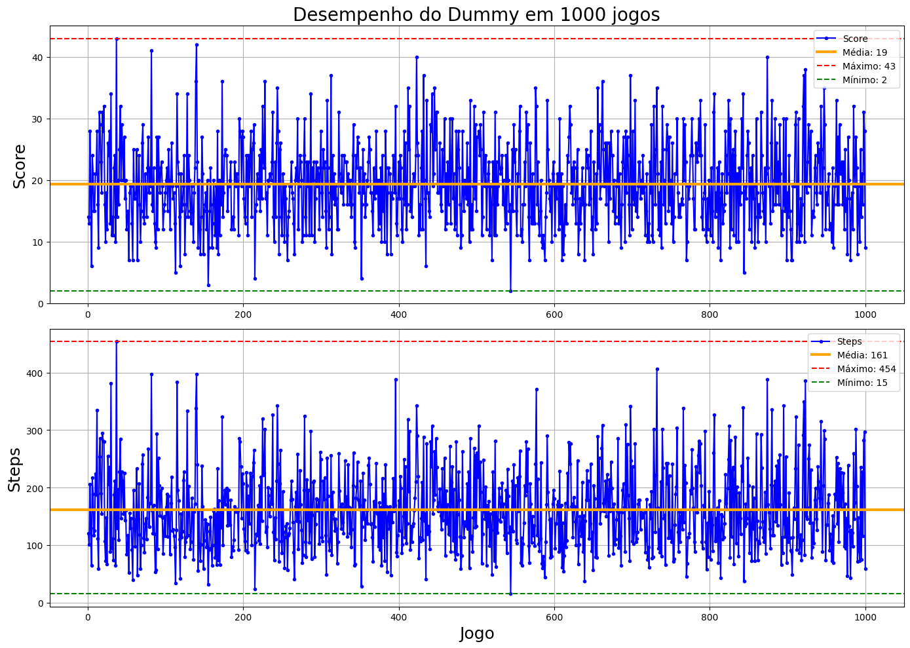

Segue o GIF de duas partidas completas (com desempenhos de 20 e 31 pontos):

  

### 7.2 Neural

O treinamento foi feito com 10.000 cobras, jogando por 1000 gerações, totalizando 10.000.000 de partidas.

Durante o treinamento, algumas cobras conseguiram pontuações muito altas (uma conseguiu até zerar), mas em média elas conseguem ocupar apenas metade do tabuleiro.

Esse comportamento de altas pontuações apenas durante o treinamento se deve à aleatoriedade do jogo: provavelmente as comidas foram aparecendo perto da cobra, evitando que ela colidisse consigo mesma.

  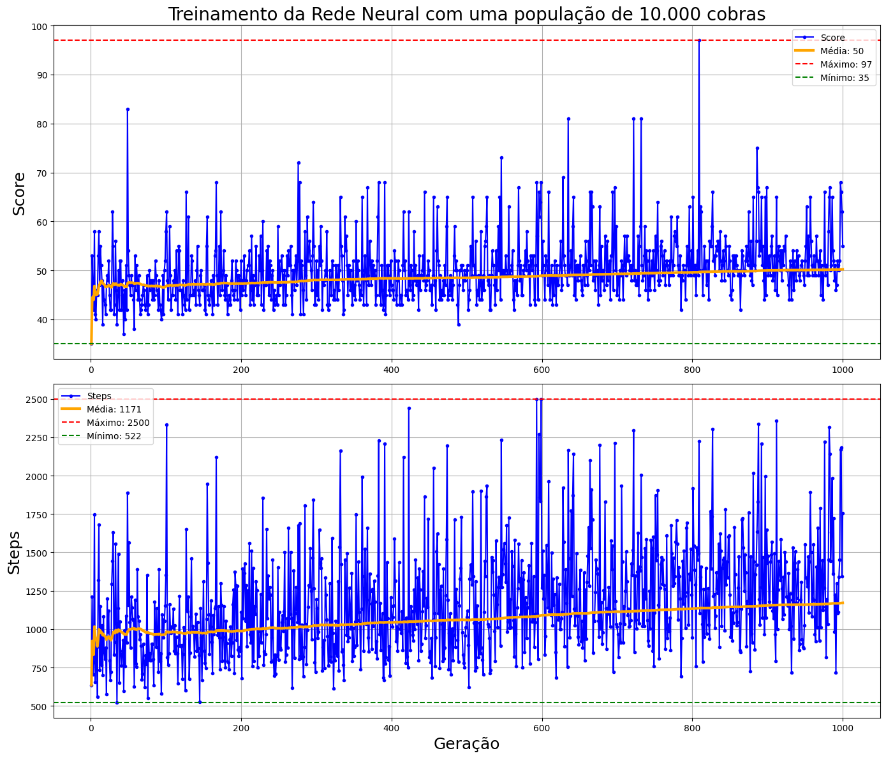

Nessa versão o player Neural jogou as 1000 partidas, mas não conseguiu ganhar nenhuma.

A pontuação média foi de 34 pontos, com mínima de 17 e máxima de 74.

A média de movimentos ficou em 874, com mínima de 355 e máxima de 2500.

  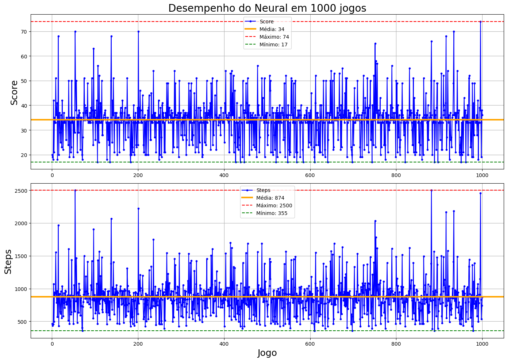

Perceba que a cobra aprendeu a seguir um padrão de movimento circular anti-horário, o que diminui as chances de colisão, mas ainda é ineficiente em relação à quantidade de movimentos.

Segue o GIF de uma das partidas:

  

### 7.3 Star

O player Star jogou 1000 partidas e ganhou (atingiu 97 pontos) todas!

A média de movimentos ficou em 1332, com mínima de 899 e máxima 1744.

Para ter mais confiança que esse algoritmo sempre ganha, realizei mais 100.000 jogos e ele GANHOU TODOS.

  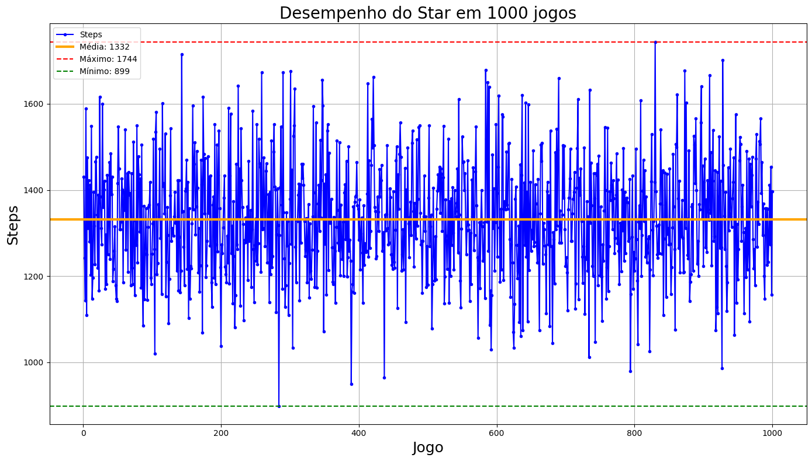

Segue o GIF de uma das partidas:

  

## 8 - Tabuleiros maiores

Coloquei o Star para jogar em tabuleiros maiores, para ver como se comporta quando o problema escala.

| Size    | Score  | Steps     | Time   |
|---------|--------|-----------|--------|
| 10x10   | 97     | 1.140     | 0.2 s  |
| 20x20   | 397    | 13.623    | 2 s    |
| 30x30   | 897    | 69.296    | 25 s   |
| 40x40   | 1.597  | 226.289   | 3 min  |
| 50x50   | 2.497  | 616.980   | 18 min |

Veja o GIF do 20x20 (cortei algumas partes do meio):

  

## 9 - Veredito

Na versão mais simples, o Dummy acabou tendo o melhor desempenho, seguido pelo Star e por fim o Neural.

Já na versão clássica, o Star foi o melhor, ganhando todos os jogos que disputou. O Neural ficou em segundo lugar e o Dummy em último.

## 10 - Referências

### Victor Dias, do canal Universo Programado

Ele fez uma série com 3 vídeos no canal com diversos algoritmos e técnicas para zerar o snake game.

No último vídeo ele apresenta essa sacada usada no player Star, onde basta limitar o padrão de movimento da cobra em cada posição para que ela nunca colida consigo mesma.

Segue o vídeo: https://youtu.be/Vii9XiQ8bec

### Gráficos e estatísticas

- Utilizei o Briefer pra gerar os gráficos, é muito simples de usar e de baixar as imagens.
