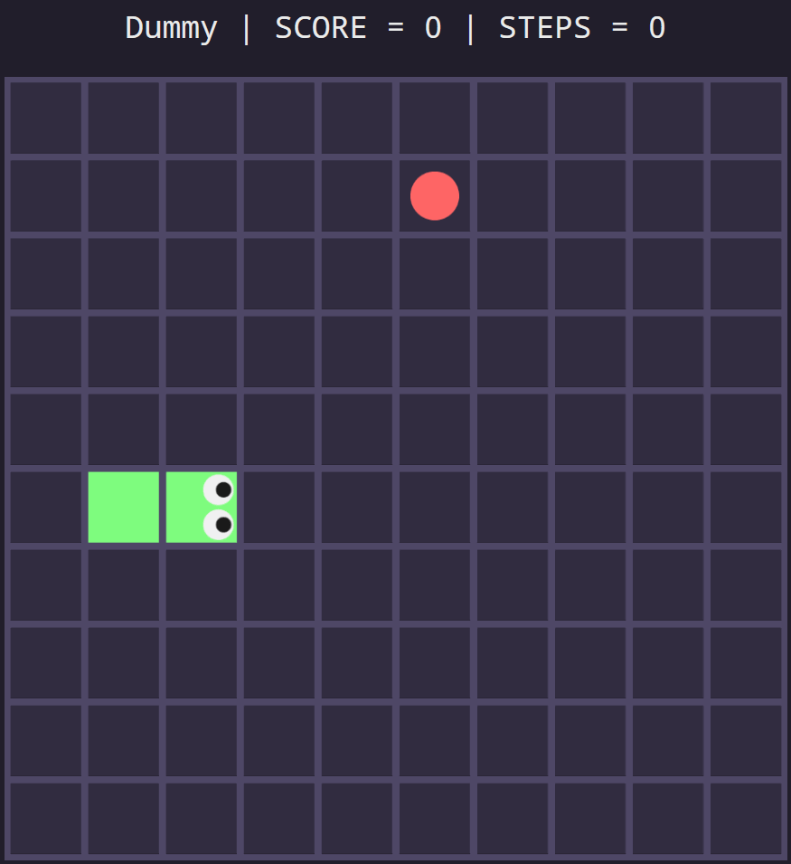
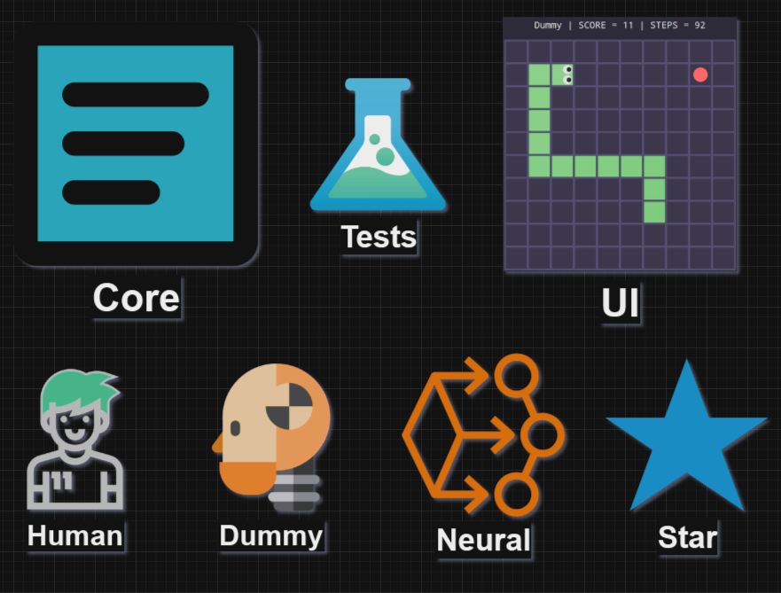
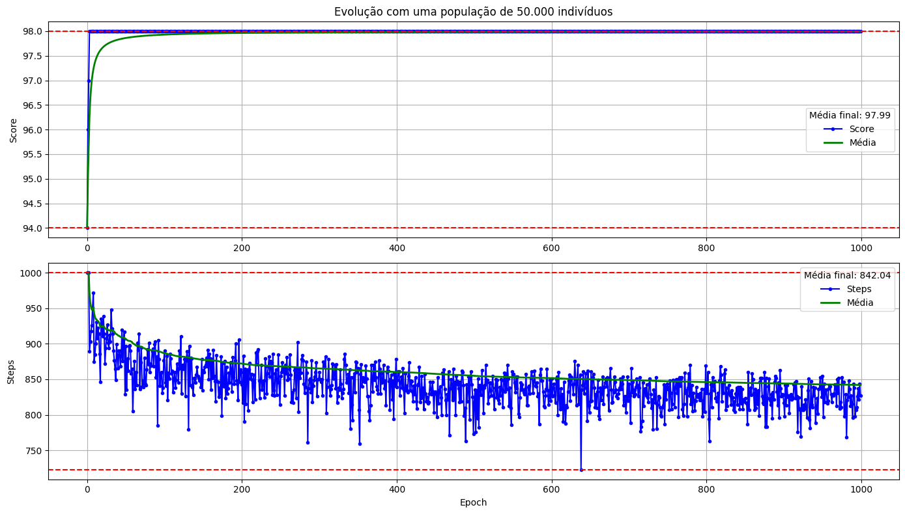
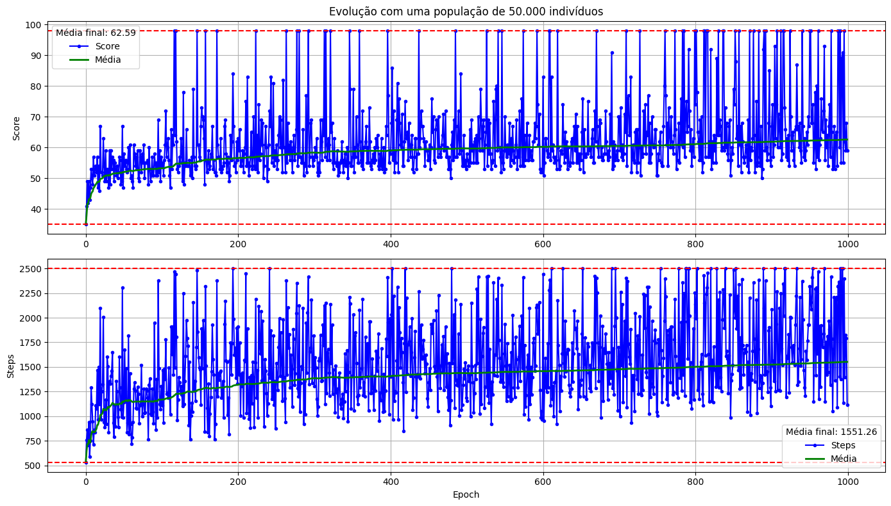
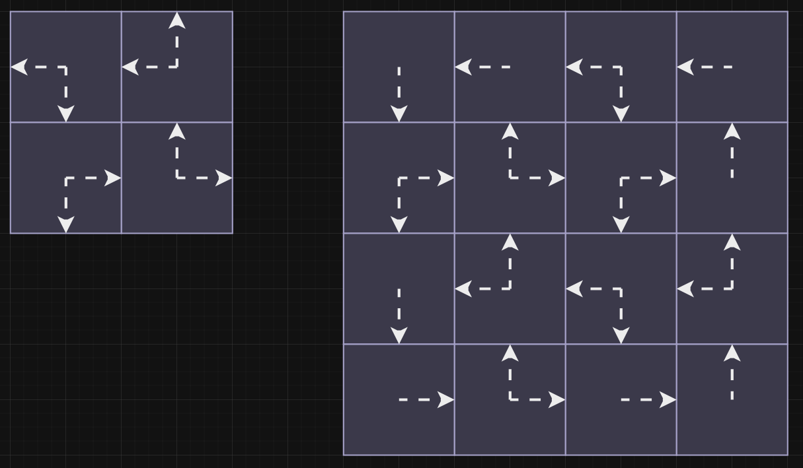

# Snake: AI 🆚 A*

O jogo da cobrinha é um clássico do nokia tijolão. Ele possui regras e objetivos simples, mas ainda sim é bem difícil de zerar.

Será que uma AI (rede neural) consegue zerar ele? E um algoritmo pathfinder (A*)? Qual dos dois se sairia melhor?

Nesse projeto vamos responder todas essas perguntas!

  

## 0 - Implementação do jogo

Acabei fazendo tudo em C#, por ser a linguagem que mais domino. Pra UI usei WPF, então infelizmente só vai rodar no Windows.

Organizei o projeto em 3 partes:
- Core: aqui fica o estado do jogo, juntamente com suas regras
- UI: responsável por mostrar na tela o estado atual do jogo
- Players: dão a direção pra cobra seguir, alterando o estado do jogo

No caso dos players, temos 4 opções:
- Human: um humano pode jogar usando o teclado
- Dummy: um algoritmo simples (monte de if/else) que guia a cobra diretamente até a comida
- Neural: uma rede neural que recebe dados do estado do jogo e decide pra onde a cobra deve ir
- Star: um A* modificado que também recebe o estado do jogo e define a próxima direção da cobra

Também adicionei testes automatizados que validam tanto as regras do jogo (Core) quanto ao algoritmos dos players.

A ideia de separar Core, UI e Players trás algumas vantagens:
- Consigo realizar testes unitários em cada parte do sistema separadamente
- Dá pra avaliar o desempenho de cada player em milhares de jogos, apenas usando o Core (sem o custo de renderizar a UI)
- Pro caso do player Neural, é possível realizar o treinamento da rede apenas usando o Core (novamente, sem o custo de renderizar a UI)

  

## 1 - Dummy

Apenas segue a linha e a coluna da comida.

## 2 - Neural

  

## 3 - Star

## ? - Versão mais simples

## Model

## Train

### Simple version

 
<video src="./Docs/best_simple_snake.mp4" width="800" style="display: block; margin: 0 auto" controls></video>

### Complete version

 
<video src="./Docs/best_complete_snake.mp4" width="800" style="display: block; margin: 0 auto" controls></video>

## Best solver

 

## Pathfindings

- https://youtu.be/mZfyt03LDH4
- https://youtu.be/2JNEme00ZFA
- https://youtu.be/MenMqx9pumw

## TODOS

- Portais (por tempo limitado)
- Obstaculos (clicar e adicionar)
- Comida que se mexe (mais devagar?)
- Comidas que valem tamanhos maiores que um
- Representar cobra como gradiente de cor ficando mais claro
- Analisar se eh possível mudar a horientação das setas no meio do jogo

Zerando => https://youtu.be/Vii9XiQ8bec
