# Snake: AI 🆚 A*

O jogo da cobrinha é um clássico do nokia tijolão. Ele possui regras e objetivos simples, mas ainda sim é bem difícil de zerar.

Será que uma AI (rede neural) consegue zerar ele? E um algoritmo pathfinder (A*)? Qual dos dois se sairia melhor?

Nesse projeto vamos responder todas essas perguntas!

  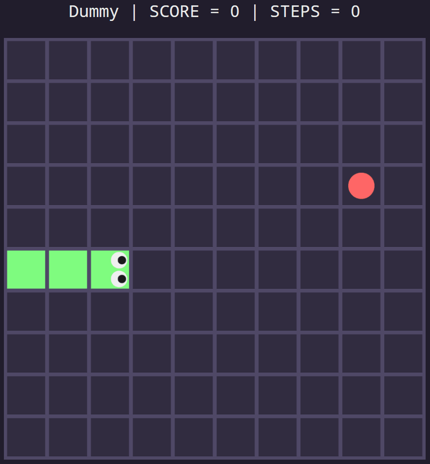

## 1 - Implementação do jogo

Acabei fazendo tudo em C#, por ser a linguagem que mais domino. Pra UI usei WPF, então infelizmente só vai rodar no Windows.

Também implementei duas versões do jogo:
- Uma mais simples, onde a cobra não aumenta de tamanho ao pegar a comida.
- A versão clássica, onde a cobra aumenta uma unidade a cada comida coletada.

Independente da versão, é preciso atingir uma pontuação de 97 pontos para ganhar. Afinal, é um tabuleiro 10x10 e a cobra inicia com tamanho 3.

Pensar em uma versão mais simples do problema geralmente ajuda no entendimento e na solução do problema original.

  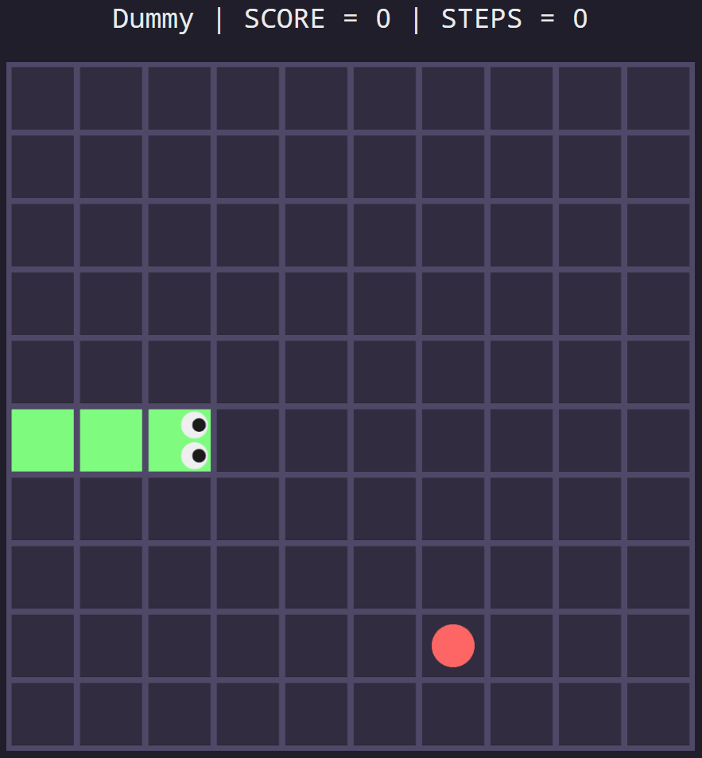
  

Organizei o projeto em 3 partes:
- **Core**: aqui fica o estado do jogo, juntamente com suas regras
- **UI**: responsável por mostrar na tela o estado atual do jogo
- **Players**: dão a direção pra cobra seguir, alterando o estado do jogo

No caso dos players, temos 4 opções:
- **Human**: um humano pode jogar usando o teclado
- **Dummy**: um algoritmo simples (monte de if/else) que guia a cobra diretamente até a comida
- **Neural**: uma rede neural que recebe dados do estado do jogo e decide pra onde a cobra deve ir
- **Star**: um algoritmo A* modificado, que também recebe o estado do jogo e define a próxima direção da cobra

Também adicionei testes automatizados que validam tanto as regras do jogo (Core) quanto os algoritmos dos players.

A ideia de separar Core, UI e Players traz algumas vantagens:
- Consigo realizar testes unitários em cada parte do sistema separadamente
- Dá pra avaliar o desempenho de cada player em milhares de jogos, apenas usando o Core (sem o custo de renderizar a UI)
- Pro caso do player Neural, é possível realizar o treinamento da rede apenas usando o Core (novamente, sem o custo de renderizar a UI)

  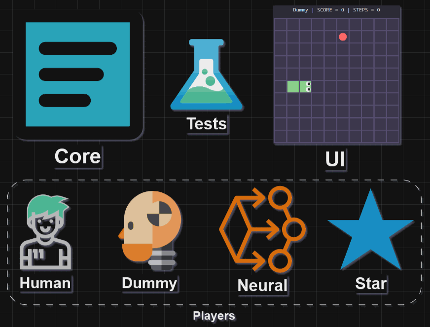

## 2 - Human

Esse player serviu apenas para que eu pudesse jogar durante a implementação.

Até pensei em criar um modo onde é possível jogar contra os outros tipos de players:
- Um humano controlando uma cobra via teclado
- Um dos outros 3 algoritmos controlando outra cobra, dentro do mesmo ambiente
- Apenas uma comida aparece por vez, pra ver quem consegue chegar nela primeiro
- Colidir em si mesmo ou na outra cobra faz você perder o jogo

E mais interessante ainda seria um algoritmo contra o outro.

Mas isso tudo vai ficar pra uma v2 desse projeto...

## 3 - Dummy

Esse algoritmo é o mais trivial possível: um conjunto de if/else que direciona a cobrinha pra linha/coluna da comida.

Vou usar ele como base de comparação pros outros dois algoritmos.

  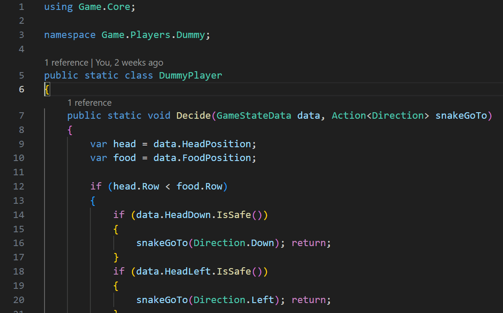

## 4 - Neural

Rede neural é uma técnica de aprendizado de máquina inspirada no funcionamento do cérebro humano. Uma rede é formada por neurônios, organizados em camadas e conectados por meio de pesos ajustáveis.

Podemos abstrair uma rede como sendo uma função matemática, que é capaz de receber dados de entrada, precessá-los e retornar uma saída.

No nosso caso, a rede vai pegar dados do estado atual do jogo, processá-los internamente e no final retornar pra qual direção a cobra deve ir.

A rede neural desenvolvida neste projeto é formada por:
- 4 neurônios na camada de entrada
- 8 neurônios na camada oculta
- 4 neurônios na camada de saída

O treinamento dela foi feito utilizando um algortimo genético.

### 4.1 - Funcionamento

Durante o jogo, logo antes da cobra se movimentar, os dados do estado atual do jogo são processados pela rede, que no final retorna para qual direção a cobra deve ir.

#### 4.1.1 Entrada

O diagrama a seguir mostra os dados de entrada da rede:
- **Δx**: "distância" entre a cabeça da cobra e comida na direção x.
  - Na prática, é feita a subtração entre a coluna da comida e a da cobra:
    - Caso dê positivo, **Δx=1**
    - Caso estejam na mesma coluna, **Δx=0**
    - Caso dê negativo, **Δx=-1**
- **Δy**: "distância" entre a cabeça da cobra e comida na direção y.
  - Na prática, é feita a subtração entre a linha da comida e a da cobra:
    - Caso dê positivo, **Δy=1**
    - Caso estejam na mesma linha, **Δy=0**
    - Caso dê negativo, **Δy=-1**
- **Vx**: velocidade da cobra no eixo x.
- **Vy**: velocidade da cobra no eixo y.

Perceba que as velocidades estão relacionadas, pois se a cobra está indo:
- Pra direita: **Vx=1** e **Vy=0**
- Pra baixo: **Vx=0** e **Vy=1**
- Pra esquerda: **Vx=-1** e **Vy=0**
- Pra cima: **Vx=0** e **Vy=-1**

  

#### 4.1.2 Processamento

Cada linha tracejada ligando um neurônio a outro possui um determinado peso. Esse peso é um número que pode variar entre -1000 e +1000. Quando uma rede é criada, cada peso é inicializado aleatoriamente (mas ainda dentro desses limites).

Cada neurônio da camada oculta recebe os 4 valores de entrada (Δx, Δy, Vx e Vy), multiplica cada valor pelo seu respectivo peso e soma tudo no final.

Perceba que o valor dessa soma (S) é no máximo 3000, caso onde todos os pesos são 1000, Δx=Δy=1, Vx=1 ou Vy=1.

Por fim, S é dividido por 3000, para que a saída no neurônio seja normalizada em um valor que fica sempre entre -1 e +1.

Esse processo se repete entre a camada oculta e a de saída, só que agora dividindo por 8000.

#### 4.1.3 Output

No final, o output de cada neurônio de saída é um numéro entre 0 e 1, pois pego apenas o valor absoluto do resultado da normalização.

Assim, a cobra segue para a direção que retornou o maior valor absoluto de saída na rede.

### 4.2 - Treinamento (algoritmo genético)

O treinamento da rede serve para refinar o valor dos seus pesos.

Como foi dito antes, ao criar uma rede nova, todos os pesos são inicializados aleatoriamente.

Como o conjunto dos pesos acaba por definir o comportamento da rede, precisamos de alguma forma ajustar cada valor para que a rede produza saídas que levem a cobra a performar bem no jogo.

Existem várias formas de fazer isso, mas aqui irei utilizar um algoritmo genético bem intuitivo:

⚠️ O processo a seguir será repetido por 1000 gerações ⚠️

- 1️⃣ Vamos criar uma população de 50.000 cobras, cada uma com seus próprios pesos aleatórios
- 2️⃣ Cada cobra vai ser colocada pra jogar separadamente
- 3️⃣ Ao final de todos os jogos, vamos analisar o desempenho de cada cobra
- 4️⃣ Um hanking será montado, ordenando as cobras com maior pontuação e em seguida com o menor número de movimentos realizados
- 5️⃣ As top 20% das cobras serão selecionadas para jogarem na próxima geração
- 6️⃣ As próximas 20% do hanking serão cruzadas com as 20% anteriores, gerando novas cobras com relativo potencial no jogo
- 7️⃣ As demais serão descartadas, ou melhor, substituídas por novas cobras com pesos aleatórios

Para evitar que uma cobra fique andando em círculos e o jogo nunca termine, defini um limite de passos que podem ser realizados antes do jogo acabar.

  

Ao final do treinamento, a melhor cobra (rede neural) será selecionada para competir contra os demais players. Ela pode ser representada pelos pesos que ligam seus neurônios e definem o comportamento da cobra no jogo.

Assim, todo treinamento é feito com o objetivo de chegar em duas matrizes de pesos refinados, como as mostradas a seguir:

  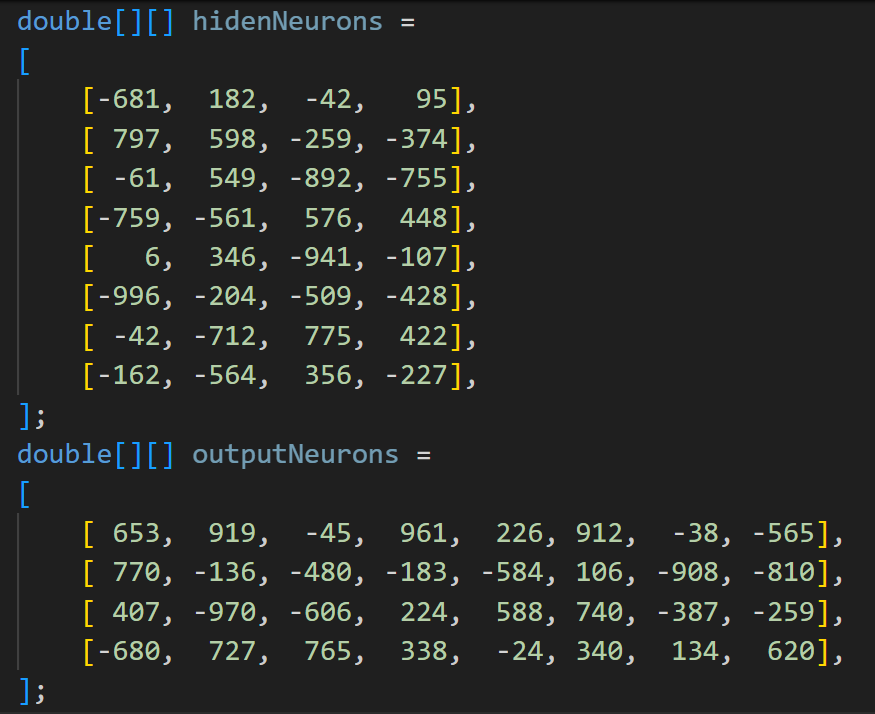

## 5 - Star

A parte mais difícil desse jogo é quando a cobra ocupa mais da metade do tabuleiro. A partir daí as chances de se prender no próprio corpo e perder o jogo só aumentam.

Para lidar com isso, o algoritmo a seguir se baseia em duas coisas:
- Limitar as direções de movimento da cobra em cada posição (seguindo um padrão bem definido)
- Buscar o menor caminho até a comida, respeitando o limite anterior (usando o algoritmo A*)

### 5.1 - Limitando os caminhos possíveis

Para limitar as direções possíveis de movimento da cobra em cada posição, repetimos o padrão a seguir por todo o tabuleiro.

Dessa forma, basta que a cobra respeite esses limites para que jamais fique sem saída e acabe perdendo o jogo.

  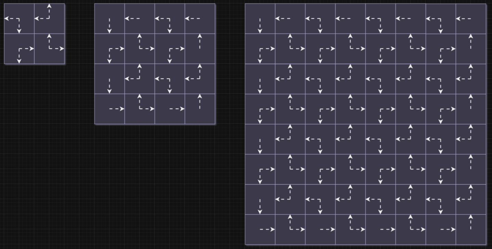

### 5.2 - A* Pathfinder

Aqui utilizamos o algoritmo pathfinder A* para definir qual o menor caminho da cabeça da cobra até a comida.

Caso não seja possível chegar até a comida, busca-se o menor caminho até a calda da cobra. Dessa forma, em algum momento a cobra vai chegar numa posição na qual é possível acessar a comida novamente.

A seguir podemos ver isso tudo funcionando:
- A cobra sempre se move respeitando as setas (limites de direção)
- Antes de cada movimento, ela calcula o menor caminho até a comida
- Os pontinhos amarelos no GIF representam o caminho calculado

  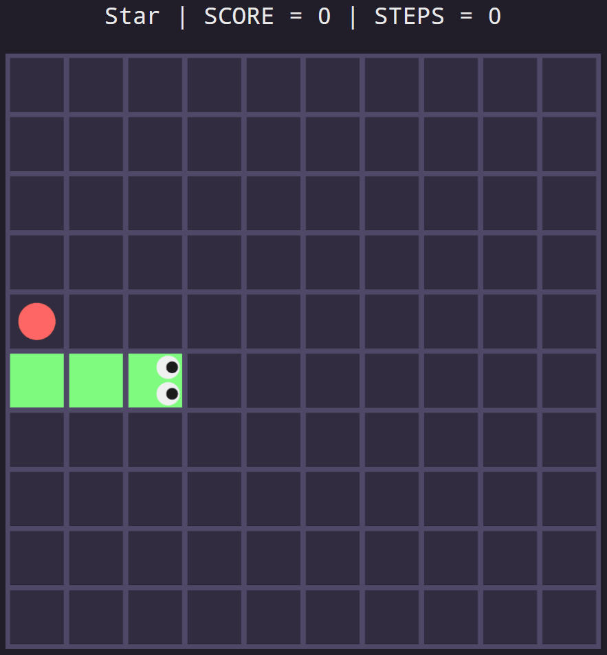

## 6 - Versão mais simples

Agora que já entendemos como o jogo e os algoritmos funcionam, vamos iniciar com a versão mais simples do jogo, onde a cobra não cresce ao pegar a comida.

É esperado que todos os algoritmos se saiam bem nessa versão, pois é impossível perder o jogo por colisão com o próprio corpo.

### 6.1 Dummy

Coloquei esse monte de if/else pra jogar 1000 partidas e ele ganhou (atingiu 97 pontos) em todas!

Veja que a quantidade de movimentos varia devido à aleatoriedade do jogo, pois a comida pode aparecer em qualquer lugar vazio do tabuleiro.

A média de movimentos ficou em 678. A quantidade mínima foi 581 e a máxima 812 movimentos.

  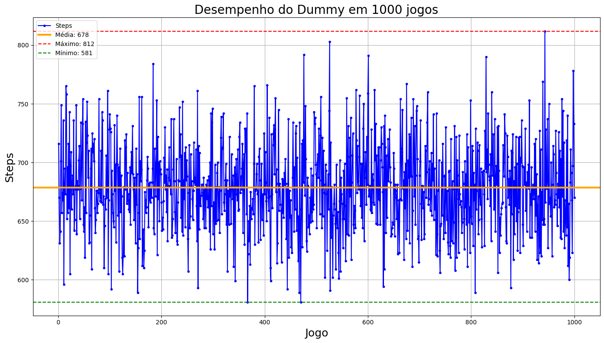

Segue o GIF de uma das partidas completa:

  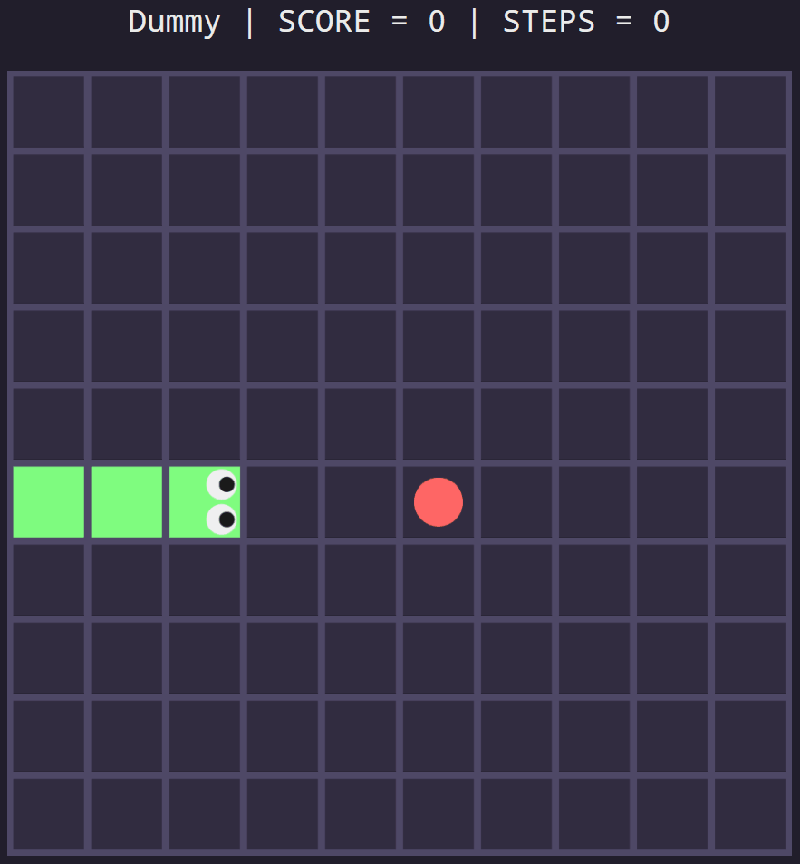

### 6.2 Neural

O treinamento foi feito com 5000 cobras, jogando por 1000 gerações, totalizando 5.000.000 de partidas.

As cobras rapidamente aprenderam a perseguir a comida, pois desde a primeira geração já surgiu pelo menos uma que ganhou o jogo.

A partir daí, as cobras que conseguiam zerar com o menor número de movimentos foram sendo selecionadas e passadas para próxima geração.

  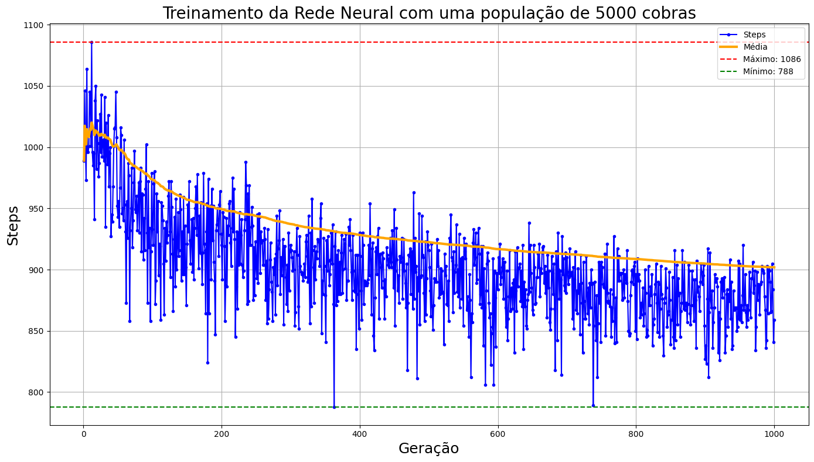

No final foi obtida a cobra com o melhor desempenho, ou seja, que atinge a pontuação máxima utilizando o menor número de movimentos.

Coloquei ela pra jogar 1000 partidas e ela ganhou (atingiu 97 pontos) em todas!

A média de movimentos ficou em 958. A quantidade mínima foi 817 e a máxima 1099 movimentos.

  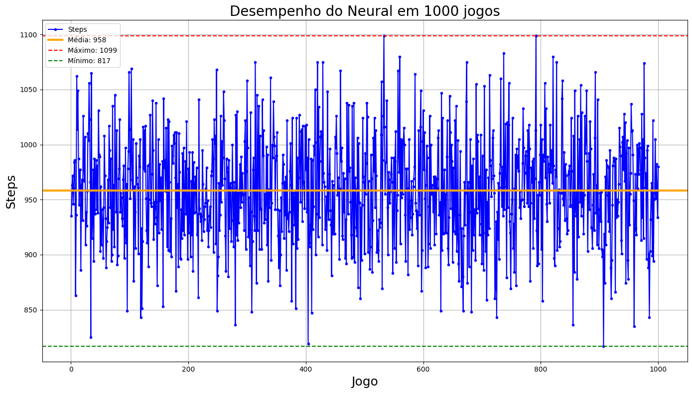

Segue o GIF de uma das partidas completa:

  

### 6.3 Star

Coloquei o Star pra jogar 1000 partidas e ele ganhou (atingiu 97 pontos) em todas!

A média de movimentos ficou em 765. A quantidade mínima foi 631 e a máxima 901 movimentos.

  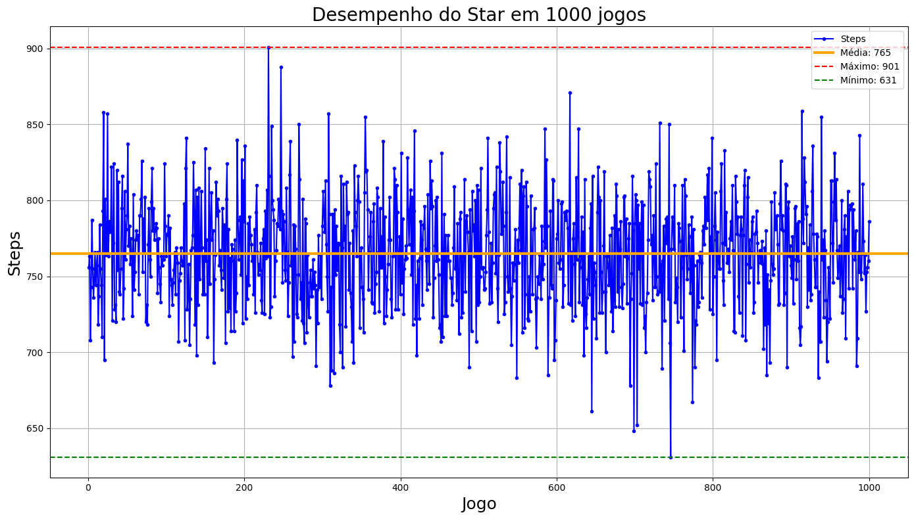

Segue o GIF de uma das partidas completa:

  

## 7 - Versão clássica

Finalmente vamos realizar a disputa na versão clássica do jogo.

### 7.1 Dummy

Ela só conseguiu pegar em média 19 comidas, ou seja, só conseguiu ocupar 1/5 do tabuleiro.

  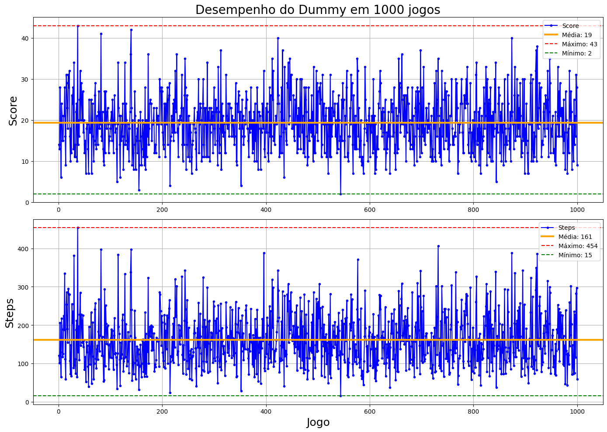

Segue o GIF de duas partidas completas:

  

### 7.2 Neural

O treinamento foi feito com 10.000 cobras, jogando por 1000 gerações, totalizando 10.000.000 de partidas.

Perceba que a cobra aprendeu a seguir um padrão de movimento circular, o que diminui as chances de colisão.

Durante o treinamento, algumas cobras conseguiram pontuações muito altas (uma conseguiu até zerar), mas em média elas elas conseguem ocupar apenas metade do tabuleiro.

Esse comportamento de altas pontuações apenas durante o treinamento se deve à aleatoriedade do jogo: provavelmente as comidas foram aparecendo perto da cobra, evitando que ela colidisse consigo mesma.

  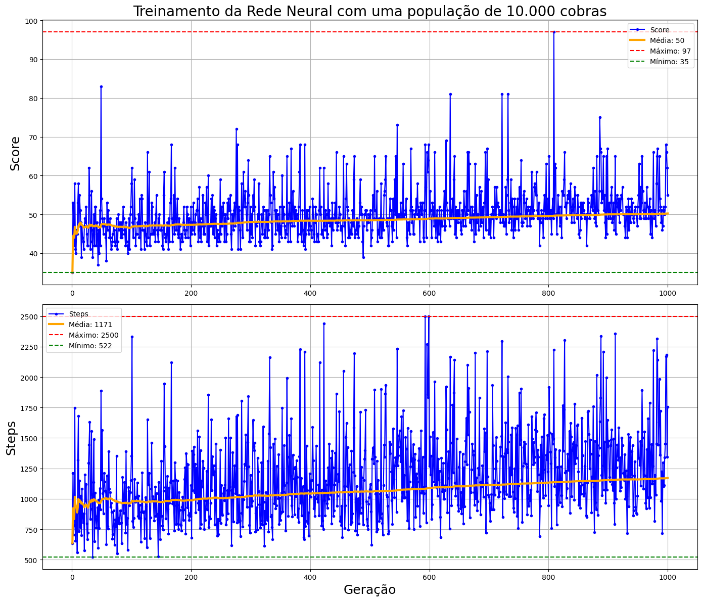

Coloquei ela pra jogar 1000 partidas e ela não conseguiu ganhar nenhuma.

A média de movimentos ficou em aaa. A quantidade mínima foi aaa e a máxima aaa movimentos.

  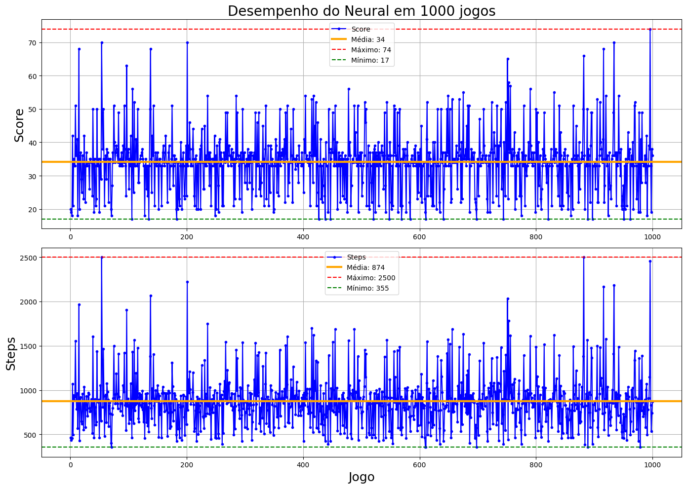

Segue o GIF de uma das partidas completa:

  

### 7.3 Star

Coloquei o Star pra jogar 1000 partidas e ele ganhou (atingiu 97 pontos) em todas!

A média de movimentos ficou em xxx. A quantidade mínima foi xxx e a máxima xxx movimentos.

Para ter mais confiança que esse algoritmo sempre ganha, realizei mais 1.000.000 de jogos, e ele GANHOU TODOS.

  

Segue o GIF de uma das partidas completa:

  

## 8 - Tabuleiros maiores

Coloquei o Star para jogar em tabuleiros maiores, para ver como se comporta quando o problema escala.

| Size    | Score | Steps | Time     |
|---------|-------|-------|----------|
| 10x10   |       |       | 60 s     |
| 20x20   |       |       |          |
| 50x50   |       |       |          |
| 100x100 |       |       |          |

GIF do 50x50:

## 9 - Veredito

Na versão mais simples, o Dummy acabou tendo o melhor desempenho, seguido pelo Star e por fim o Neural.

Já na versão clássica, o Star foi perfeito, ganhando simplesmente todos os jogos que disputou. Dummy e Neural ficaram tecnicamente empatados.

## 10 - Referências

### Victor Dias, do canal Universo Programado

Ele fez uma série com 3 vídeos no canal com diversos algoritmos e técnicas para zerar o snake game.

No último vídeo ele apresenta essa sacada usada no player Star, onde basta limitar o padrão de movimento da cobra em cada posição para que ela nunca colida consigo mesma.

Segue o vídeo: https://youtu.be/Vii9XiQ8bec
